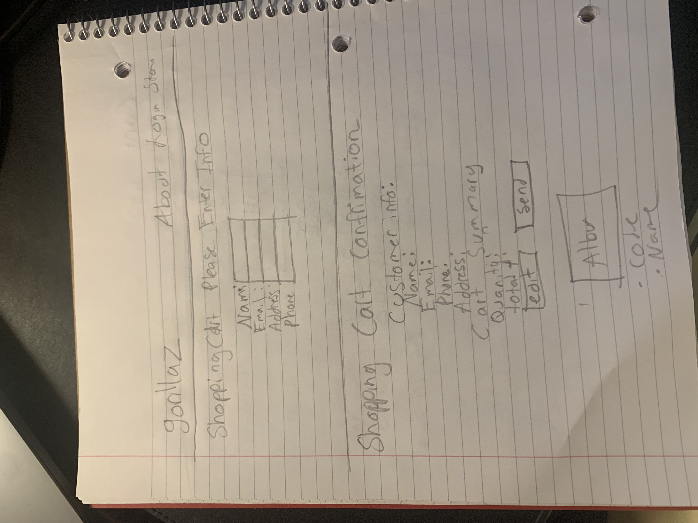

## Vinyl Ecommerce App

This app is band site for the band Gorillaz, and it doubles as an en ecommerce store. In this app users are able to browse the website while shopping. Mangers will be abe to update the store.

- [Daily Progress](#Daily-Progess)
- [User Stories](#User-Stories)
    - [User](#User)
    - [Employee](#Employee)
    - [Manager](#Manager)
- [Jira](https://www.google.com/)

## Daily Progress
- [Rubric Progress](https://docs.google.com/document/d/1ZbVkJttdXHiQVjiffhGwbZS45-2beWKIb5-VGY7gfB4/edit)
- 4/26(100% done) IM DONE!
- Finished Crud operations 
- Finished Styling Issues
- Posted WireFrames
- Cleaned up all issues

- 4/23(85% done)
- Finished Crud operations for Accounts officially
- Working on Tests and CSS styling now.
- Need to work on Wire Frames.
- 
- 4/22(75% done)
  - Finished Crud operations for Accounts
  - Need to work on styling as well as Cart Saving to database

- 4/21(75% done)
  - Finished Static templates.
  - Was able to finish cart check out process.
  - Can't get order to save in database or images to show.
  - Work on admin Functionality Tomorrow .

- 4/20(65% done)
  - Reconfigured Repos, contollers and Services 
  - Need to work on the static pages now
  - Cant get pass the login now
  - 

- 4/19(65% done)
  - Took a step back application isnt running something wrong with "session factory " and "Transaction Manger"
  - Can't seem to figure it out using online resources and classmates but can't seem to figure it out.
  - Working on Static templates now
  - worked on Admin Controller Tomorrow.

- 4/16-4/18 (70% done)
  - Fixed bugs  on Daos
  - Working on Static templates now
  - Almost done with MainController 
  - Will work on Admin Controller Tomorrow.
  
- 4/15 (65% done)
  - Worked on forms
  - Worked on Daos
  - worked on web security and config
  - pagination

- 4/14(55% done)
  - Finished Model and enity classes
  - Worked on Daos
  - Working on Forms and form validation 
 
- 4/13(45% done)
- Worked on shopping cart functionality
    - Worked on models
    - Trying to complete CRUD operations
- 4/11(40%)
    - Pushed files to Git
    - Updated Models
    - Worked on Login
  

## User Stories
### User
- As a user, I want to add albums to my cart so that I can shop as I browse.
- As a user, I want to have a confirmation page before I summit my order so that I make sure I know what I ordered.
### Employee
- As an employee , I want to have access to customer orders so that I can see what customers ordered what.
### Manager
- As a  manager,I want to create and edit album information, so I can update the store if we have more products or have to change prices.

## Technical Archeticure

## DataBase Schema

## Lessons Learned
- To use Spring JPA over Spring Hibernate.
- Planning is important .It is important To create a clear plan and use of  application before starting or you can find your self in a confusing position.
- Ask for help when stuck and to make use of  resources online and people.
- Better understanding of individual Project management.
- Have better task prioritization.

## Technical challenges
- Converting From Spring Hibernate to Spring JPA.
- Connecting front end to back end (ThymeLeaf).
- CSS/Styling issues.
- Getting Images to display from database.
- Getting user roles to work.
- Learning ThymeLeaf on the fly

## What additional features could be added in the future
- Payment options

##  Possible Connection to Optum.
- Could be possiblly be used for medical orders for patients or practitioners.

## WireFrames

